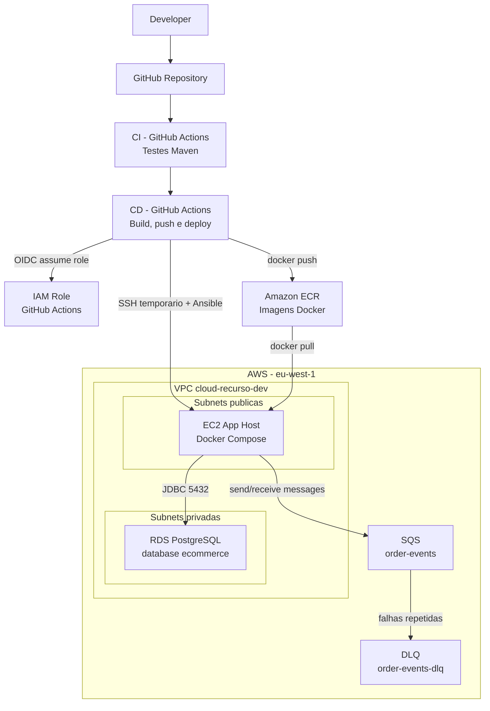
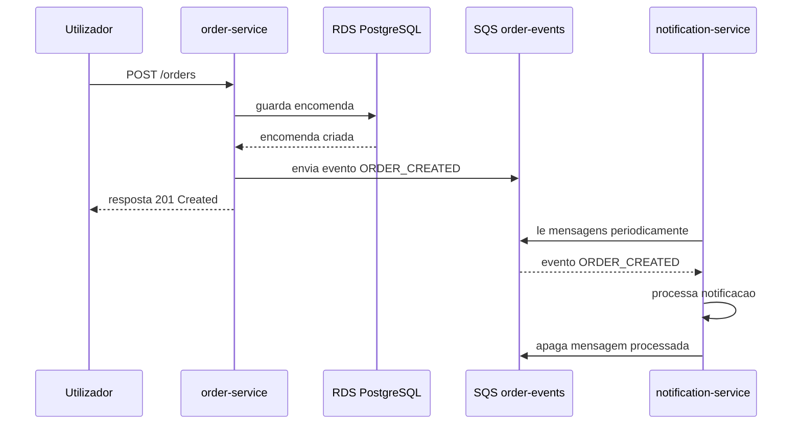

# Projeto de Computacao na Nuvem - Recurso

Sistema de microservicos para gestao simples de produtos, encomendas e notificacoes.

Este projeto foi feito com o objetivo de colocar uma aplicacao de microservicos a correr na AWS, usando infraestrutura como codigo, containers, base de dados gerida, fila de mensagens e pipeline de CI/CD.

## 1. Ideia geral do projeto

A aplicacao esta dividida em tres microservicos:

**catalog-service**

Servico responsavel pelos produtos. Permite criar, listar, atualizar e apagar produtos.

Porta: `8081`

**order-service**

Servico responsavel pelas encomendas. Permite criar, listar, atualizar e apagar encomendas. Quando uma encomenda e criada, este servico publica um evento numa fila SQS.

Porta: `8082`

**notification-service**

Servico responsavel por processar notificacoes. Neste projeto, ele consome eventos da fila SQS e processa a notificacao associada a uma encomenda criada.

Porta: `8083`

A comunicacao mais importante do projeto e entre o `order-service` e o `notification-service`. Em vez de o `order-service` chamar diretamente o `notification-service`, ele envia uma mensagem para o SQS. Assim, os dois servicos ficam menos dependentes um do outro.

## 2. Escolha da arquitetura

Para este projeto escolhi uma arquitetura simples, mas que usa servicos reais de cloud e que e facil de explicar na defesa.

Em vez de usar logo Kubernetes ou ECS, optei por usar uma instancia EC2 com Docker Compose. Esta escolha faz sentido para o recurso porque permite demonstrar:

- microservicos separados;
- deploy com containers;
- infraestrutura na AWS;
- rede com VPC, subnets publicas e privadas;
- base de dados privada em RDS;
- comunicacao assincrona com SQS;
- CI/CD com GitHub Actions;
- configuracao automatica com Terraform e Ansible.

Tambem e uma arquitetura mais controlavel para um projeto individual. Kubernetes ou ECS seriam opcoes mais avancadas, mas tambem iam aumentar bastante a complexidade da entrega.

## 3. Componentes usados

**AWS VPC**

Rede isolada onde ficam os recursos principais do projeto.

**Subnets publicas**

Usadas para recursos que precisam de acesso pela Internet. Neste projeto, a EC2 fica numa subnet publica porque os microservicos precisam de estar acessiveis para demonstracao e o deploy usa SSH/Ansible.

**Subnets privadas**

Usadas para recursos que nao devem estar acessiveis diretamente pela Internet. A base de dados RDS fica aqui.

**EC2**

Maquina onde correm os containers Docker dos tres microservicos.

**RDS PostgreSQL**

Base de dados gerida pela AWS. E usada pelos servicos que precisam de persistencia.

**SQS**

Fila usada para comunicacao assincrona entre `order-service` e `notification-service`.

**DLQ**

Dead Letter Queue ligada a fila principal. Serve para guardar mensagens que falham varias vezes.

**ECR**

Repositorio privado onde ficam guardadas as imagens Docker dos microservicos.

**Terraform**

Usado para criar e manter a infraestrutura AWS.

**Ansible**

Usado para configurar a EC2 e fazer deploy dos containers.

**GitHub Actions**

Usado para CI e CD. O CI corre testes. O CD cria as imagens, envia para o ECR e faz deploy na EC2.

## 4. Desenho geral da arquitetura



## 5. Desenho da VPC e subnets

Este desenho e o que uso para perceber melhor onde esta cada coisa dentro da rede.

```text
                              INTERNET
                                  |
                                  |
                         +----------------+
                         | Internet       |
                         | Gateway        |
                         +----------------+
                                  |
                                  v
+--------------------------------------------------------------------------+
| VPC cloud-recurso-dev                                                     |
|                                                                          |
|  +--------------------------------+     +--------------------------------+ |
|  | Public Subnet 1                |     | Public Subnet 2                | |
|  |                                |     |                                | |
|  | EC2 App Host                   |     | Reserva / crescimento futuro   | |
|  | Docker Compose                 |     |                                | |
|  |                                |     |                                | |
|  |  - catalog-service : 8081      |     |                                | |
|  |  - order-service   : 8082      |     |                                | |
|  |  - notification    : 8083      |     |                                | |
|  |                                |     |                                | |
|  | Security Group app             |     |                                | |
|  |  - SSH 22 controlado           |     |                                | |
|  |  - portas 8081-8083            |     |                                | |
|  +--------------------------------+     +--------------------------------+ |
|                 |                                                        |
|                 | JDBC porta 5432                                        |
|                 v                                                        |
|  +--------------------------------+     +--------------------------------+ |
|  | Private Subnet 1               |     | Private Subnet 2               | |
|  |                                |     |                                | |
|  | RDS PostgreSQL                 |     | Subnet usada pelo DB subnet    | |
|  | Nao acessivel pela Internet    |     | group do RDS                   | |
|  |                                |     |                                | |
|  | Security Group DB              |     |                                | |
|  |  - aceita 5432 apenas da app   |     |                                | |
|  +--------------------------------+     +--------------------------------+ |
|                                                                          |
+--------------------------------------------------------------------------+

Fora da VPC, mas ainda dentro da AWS:

  +-------------------------+               +------------------------------+
  | ECR                     |               | SQS                          |
  | Imagens Docker          |               | order-events                 |
  | dos microservicos       |               | order-events-dlq             |
  +-------------------------+               +------------------------------+
          ^                                             ^          |
          | docker pull                                 |          |
          |                                             |          v
        EC2                                      order-service  notification-service
```

## 6. Comunicacao entre microservicos



Este fluxo e importante porque mostra a vantagem do SQS. A criacao da encomenda nao depende diretamente do `notification-service`. Se o servico de notificacoes estiver temporariamente em baixo, a mensagem continua na fila e pode ser processada depois.

## 7. Fluxo principal da aplicacao

1. O utilizador chama o `order-service` para criar uma encomenda.
2. O `order-service` grava a encomenda no PostgreSQL.
3. Depois de gravar, o `order-service` cria um evento `ORDER_CREATED`.
4. Esse evento e enviado para a fila SQS `order-events`.
5. O `notification-service` consulta a fila periodicamente.
6. Quando encontra uma mensagem, transforma o JSON num objeto `OrderCreatedEvent`.
7. Processa a notificacao.
8. Se correr bem, apaga a mensagem da fila.
9. Se falhar varias vezes, a mensagem pode ir para a DLQ.

## 8. Rede e seguranca

A rede foi separada em subnets publicas e privadas.

A EC2 fica numa subnet publica porque neste projeto os microservicos precisam de estar acessiveis para demonstracao. A base de dados fica em subnets privadas porque nao deve estar exposta diretamente a Internet.

A Security Group da aplicacao permite:

- SSH na porta `22`, usado para administracao e deploy;
- portas `8081`, `8082` e `8083`, usadas pelos microservicos.

A Security Group da base de dados permite:

- PostgreSQL na porta `5432`, mas apenas vindo da Security Group da aplicacao.

Isto significa que a base de dados nao aceita ligacoes diretas da Internet. Apenas a EC2 consegue comunicar com ela.

Na EC2 foi usado um IAM Role. Assim, nao e preciso guardar access keys dentro da maquina. Esse role permite ler imagens do ECR e aceder ao SQS.

No GitHub Actions tambem foi usado OIDC em vez de access keys fixas. O GitHub assume um IAM Role na AWS. Esta abordagem e mais segura porque evita guardar credenciais AWS permanentes no repositorio.

No CD, o GitHub Actions abre temporariamente SSH apenas para o IP publico do runner e remove essa regra no fim do deploy. Assim, a porta 22 nao fica aberta desnecessariamente.

## 9. Infraestrutura como codigo

A infraestrutura esta organizada com Terraform.

Principais modulos:

| Modulo | Funcao |
| --- | --- |
| `infra/modules/vpc` | Cria VPC, subnets publicas, subnets privadas, Internet Gateway e route tables |
| `infra/modules/db` | Cria RDS PostgreSQL, DB subnet group e Security Group da base de dados |
| `infra/modules/compute` | Cria EC2, key pair, instance profile e IAM Role |
| `infra/modules/ecr` | Cria repositorios ECR para as imagens Docker |
| `infra/modules/queue` | Cria SQS e DLQ |
| `infra/modules/github-actions` | Cria IAM Role e permissoes para o CD |

O estado do Terraform esta num backend remoto em S3, com lock em DynamoDB. Isto evita perder o estado localmente e tambem evita alteracoes concorrentes na infraestrutura.

## 10. Containers e deploy

Cada microservico tem o seu `Dockerfile`.

O GitHub Actions constroi uma imagem Docker para cada servico e envia para o ECR:

- `cloud-recurso-dev-catalog-service`
- `cloud-recurso-dev-order-service`
- `cloud-recurso-dev-notification-service`

Na EC2, os servicos correm com Docker Compose. O ficheiro de producao e gerado pelo Ansible a partir de um template.

O Ansible recebe valores reais da infraestrutura, como:

- endpoint da base de dados;
- nome da base de dados;
- utilizador da base de dados;
- URL da fila SQS;
- imagens Docker do ECR.

Passos principais do Ansible:

1. instala Docker;
2. ativa Docker;
3. instala Docker Compose;
4. cria a pasta da aplicacao em `/opt/cloud-recurso`;
5. faz login no ECR;
6. gera o `docker-compose.yml`;
7. faz pull das imagens;
8. arranca os containers.

## 11. CI e CD

O CI corre no GitHub Actions e testa os tres microservicos com Maven e Java 21.

```text
Push / Pull Request
        |
        v
      CI
        |
        | testes passam
        v
      CD
        |
        v
Build Docker images -> Push ECR -> Ansible deploy -> Health checks
```

O CD corre quando o CI passa na branch `main` ou manualmente.

Fluxo do CD:

1. faz checkout do codigo;
2. assume IAM Role na AWS com OIDC;
3. le outputs do Terraform;
4. faz login no ECR;
5. constroi e envia as imagens Docker;
6. prepara inventario SSH para Ansible;
7. abre temporariamente SSH para o IP do runner;
8. adiciona a host key da EC2 ao `known_hosts`;
9. executa o playbook Ansible;
10. valida os health checks;
11. remove a regra temporaria de SSH.

## 12. Endpoints principais

Usar `APP_PUBLIC_IP` como o IP publico da EC2.

**catalog-service**

```text
GET    http://APP_PUBLIC_IP:8081/products
GET    http://APP_PUBLIC_IP:8081/products/{id}
POST   http://APP_PUBLIC_IP:8081/products
PUT    http://APP_PUBLIC_IP:8081/products/{id}
DELETE http://APP_PUBLIC_IP:8081/products/{id}
```

**order-service**

```text
GET    http://APP_PUBLIC_IP:8082/orders
GET    http://APP_PUBLIC_IP:8082/orders/{id}
POST   http://APP_PUBLIC_IP:8082/orders
PUT    http://APP_PUBLIC_IP:8082/orders/{id}
PATCH  http://APP_PUBLIC_IP:8082/orders/{id}/status
DELETE http://APP_PUBLIC_IP:8082/orders/{id}
```

**notification-service**

```text
POST   http://APP_PUBLIC_IP:8083/notifications/process-order
```

**Health checks**

```text
GET    http://APP_PUBLIC_IP:8081/actuator/health
GET    http://APP_PUBLIC_IP:8082/actuator/health
GET    http://APP_PUBLIC_IP:8083/actuator/health
```

## 13. Porque esta arquitetura faz sentido

Esta arquitetura faz sentido para o projeto porque mostra os principais conceitos de computacao na nuvem sem tornar a solucao demasiado complexa.

Mostra microservicos porque cada servico tem uma responsabilidade propria.

Mostra cloud porque usa recursos reais da AWS: VPC, EC2, RDS, SQS, ECR, IAM e Security Groups.

Mostra seguranca porque a base de dados nao esta publica, o acesso e controlado por Security Groups e os acessos AWS usam IAM Roles.

Mostra comunicacao assincrona porque o `order-service` publica eventos no SQS e o `notification-service` consome esses eventos.

Mostra automacao porque a infraestrutura esta em Terraform e o deploy esta em Ansible/GitHub Actions.

Para uma entrega individual, esta solucao equilibra bem simplicidade, custo, seguranca e demonstracao dos conceitos.

## 14. Limitacoes e melhorias futuras

Algumas escolhas foram feitas para manter o projeto controlado.

A EC2 e um ponto unico de execucao dos containers. Numa versao mais avancada, podia passar para ECS ou EKS.

Os servicos estao expostos diretamente por portas diferentes. Numa versao mais completa, podia usar um Application Load Balancer ou API Gateway.

O `notification-service` processa a notificacao e escreve no log. No futuro podia enviar email, guardar notificacoes numa base de dados ou disponibilizar uma listagem de notificacoes.

A base de dados e partilhada. Numa arquitetura de microservicos mais pura, cada servico podia ter a sua propria base de dados. Neste projeto mantive uma base comum para reduzir custo e complexidade.

## 15. Extensao de recurso: Disaster Recovery

Para a Epoca de Recurso, o projeto foi complementado com uma camada de Disaster Recovery.

O objetivo desta parte nao foi adicionar mais funcionalidades de negocio a aplicacao. O objetivo foi provar que o sistema consegue sobreviver a uma falha simulada no ambiente principal.

A estrategia usada foi warm standby:

- primary em `eu-west-1`;
- standby em `eu-west-2`;
- infraestrutura dos dois ambientes em Terraform;
- deploy automatizado com GitHub Actions e Ansible;
- secrets em SSM Parameter Store;
- estrategia de dados por snapshot/restore devido a restricoes Free Tier;
- workflow manual para failover drill;
- medicao de RTO durante o drill.

```text
Primary eu-west-1                 Standby eu-west-2
+------------------+              +------------------+
| VPC              |              | VPC              |
| EC2 + Docker     |              | EC2 + Docker     |
| RDS primary      |              | RDS standby      |
| SQS + DLQ        |              | SQS + DLQ        |
| SSM Parameters   |              | SSM Parameters   |
+------------------+              +------------------+
          |                                  |
          +---------------+------------------+
                          |
                          v
          SSM active endpoint para indicar o ambiente ativo
```

Workflows relacionados com DR:

- `DR Infrastructure`: faz plan/apply de `dev` e `standby`;
- `CD Standby`: faz deploy dos containers no standby;
- `DR Drill`: simula falha no primary, promove standby, mede RTO e faz rollback.

O runbook completo esta em:

```text
docs/dr.md
```

## 16. Resumo final

No fim, o projeto fica com uma aplicacao de microservicos funcional na AWS.

Resumo das responsabilidades:

- `catalog-service` gere produtos;
- `order-service` gere encomendas;
- `notification-service` reage a eventos de encomendas;
- SQS desacopla os servicos;
- RDS guarda os dados principais;
- ECR guarda as imagens Docker;
- Terraform cria a infraestrutura;
- Ansible faz o deploy;
- GitHub Actions automatiza CI/CD.

Esta foi a solucao escolhida porque permite demonstrar uma arquitetura cloud completa, mas ainda simples o suficiente para ser explicada e defendida.
