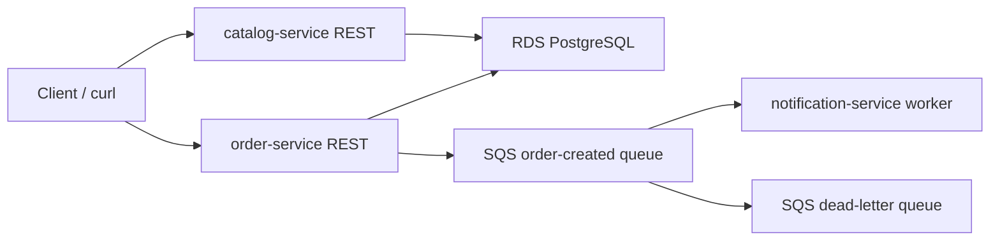

# Architecture

The selected reference architecture is the mini e-commerce backend from the
project statement.

Locally, PostgreSQL and SQS are represented by Docker Compose and LocalStack.
In AWS, Terraform provisions the VPC, EC2, RDS and SQS resources.

The async path is the main distributed-systems mechanism:

1. A client creates an order.
2. `order-service` persists the order.
3. `order-service` sends an `ORDER_CREATED` event to SQS.
4. `notification-service` polls SQS, processes the event and deletes the message.
5. Failed messages can be retried and eventually moved to the DLQ.
