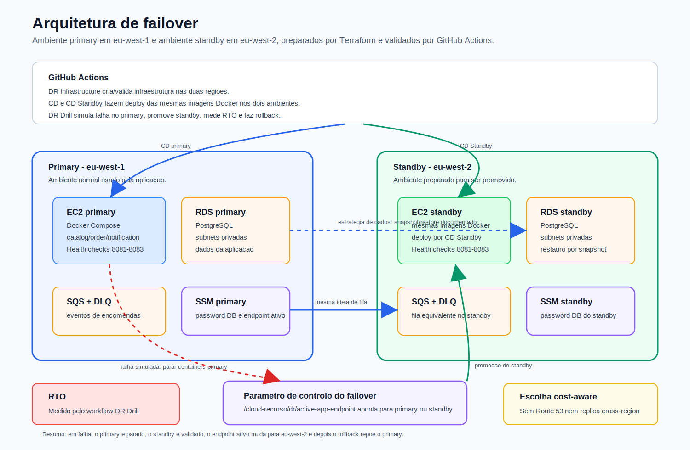

# Disaster Recovery Runbook

Este documento descreve a estrategia de Disaster Recovery usada no projeto de recurso.

O objetivo nao e adicionar novas funcionalidades a aplicacao. O objetivo e provar que o sistema consegue continuar operacional quando existe uma falha simulada no ambiente principal.

## 1. Estrategia escolhida

A estrategia escolhida foi uma abordagem de warm standby:

- primary em `eu-west-1`;
- standby em `eu-west-2`;
- infraestrutura criada por Terraform nos dois ambientes;
- deploy por GitHub Actions e Ansible;
- password da base de dados guardada em SSM Parameter Store;
- drill de failover executado por GitHub Actions, sem clicks na AWS Console.

O ambiente primary e o ambiente normal da aplicacao. O ambiente standby fica preparado noutra regiao e pode ser promovido durante um incidente.

## 2. Arquitetura DR



O desenho mostra os dois ambientes separados por regiao. O primary em `eu-west-1` e o ambiente usado normalmente. O standby em `eu-west-2` recebe as mesmas imagens Docker e fica pronto para ser promovido durante o drill. O parametro SSM `/cloud-recurso/dr/active-app-endpoint` representa qual e o endpoint ativo em cada momento.

## 3. RTO e RPO

Target RTO: 5 minutos.

O RTO e o tempo esperado para promover o standby depois de detetar falha no primary. No drill, este valor e medido automaticamente pelo workflow `DR Drill`.

Target RPO: depende do ultimo snapshot/backup disponivel.

Inicialmente a solucao foi pensada para RDS Multi-AZ e backups automaticos. No entanto, a conta AWS usada no recurso tem restricoes Free Tier que bloquearam backup retention no RDS. Para manter a solucao reprodutivel nesta conta, a estrategia ficou cost-aware: standby preparado noutra regiao, failover drill automatizado e estrategia de snapshot/restore documentada.

Numa conta sem esta limitacao, a melhoria direta seria ativar RDS Multi-AZ ou uma read replica cross-region.

## 4. Infraestrutura

A infraestrutura primary esta em:

```text
infra/envs/dev
```

A infraestrutura standby esta em:

```text
infra/envs/standby
```

Ambas reutilizam os mesmos modulos Terraform:

```text
infra/modules/vpc
infra/modules/db
infra/modules/compute
infra/modules/queue
```

O state dos dois ambientes fica no mesmo bucket S3, mas com keys diferentes:

```text
envs/dev/terraform.tfstate
envs/standby/terraform.tfstate
```

## 5. Secrets

A password da base de dados nao e passada diretamente para o container pelo GitHub Actions.

O Terraform cria um parametro SSM em cada ambiente:

```text
/cloud-recurso/dev/database/password
/cloud-recurso/standby/database/password
```

Durante o deploy, o Ansible corre na EC2 e a propria EC2 le a password no SSM Parameter Store usando o seu IAM Role.

Isto evita depender de access keys ou passwords hardcoded dentro do codigo.

## 6. Workflows usados

### CI

Workflow:

```text
.github/workflows/ci.yml
```

Corre os testes Maven dos tres microservicos.

### CD

Workflow:

```text
.github/workflows/deploy.yml
```

Faz build das imagens, push para ECR e deploy no primary.

### DR Infrastructure

Workflow:

```text
.github/workflows/dr-infra.yml
```

Faz `terraform plan` para `dev` e `standby`.

Em merge para `main`, ou manualmente com `apply=true`, tambem pode fazer `terraform apply`.

Este workflow usa OIDC para assumir o IAM Role da AWS.

### CD Standby

Workflow:

```text
.github/workflows/deploy-standby.yml
```

Faz deploy das imagens mais recentes no ambiente standby.

### DR Drill

Workflow:

```text
.github/workflows/dr-drill.yml
```

Simula uma falha no primary, promove o standby, mede o RTO e faz rollback.

## 7. Como preparar o ambiente

1. Garantir que estes secrets existem no GitHub:

```text
EC2_SSH_PRIVATE_KEY
DB_PASSWORD
ALLOWED_SSH_CIDR
```

`ALLOWED_SSH_CIDR` deve ter o formato:

```text
x.x.x.x/32
```

2. Aplicar a infraestrutura primary e standby:

```text
GitHub Actions -> DR Infrastructure -> Run workflow -> apply=true
```

3. Fazer deploy no primary:

```text
GitHub Actions -> CD
```

4. Fazer deploy no standby:

```text
GitHub Actions -> CD Standby
```

5. Confirmar health checks dos dois ambientes:

```text
http://PRIMARY_APP_IP:8081/actuator/health
http://PRIMARY_APP_IP:8082/actuator/health
http://PRIMARY_APP_IP:8083/actuator/health

http://STANDBY_APP_IP:8081/actuator/health
http://STANDBY_APP_IP:8082/actuator/health
http://STANDBY_APP_IP:8083/actuator/health
```

## 8. Como executar o failover drill

No GitHub:

```text
Actions -> DR Drill -> Run workflow
```

O workflow faz:

1. le outputs Terraform do primary e standby;
2. confirma que o primary esta saudavel;
3. simula falha no primary com SSM, parando os containers;
4. atualiza o parametro SSM `/cloud-recurso/dr/active-app-endpoint` para apontar para o standby;
5. testa os health checks do standby;
6. mede o RTO;
7. escreve o resultado no GitHub Step Summary;
8. faz rollback, voltando a arrancar os containers no primary;
9. volta a apontar o active endpoint para o primary.

## 9. Como observar o failover

Durante o drill, observar:

- logs do workflow `DR Drill`;
- Step Summary do GitHub Actions;
- parametro SSM `/cloud-recurso/dr/active-app-endpoint`;
- health checks do standby.

Comando para ver o active endpoint:

```bash
aws ssm get-parameter \
  --name /cloud-recurso/dr/active-app-endpoint \
  --region eu-west-1 \
  --query Parameter.Value \
  --output text
```

## 10. Rollback

O rollback e automatico no workflow `DR Drill`.

Mesmo que um passo falhe, o workflow tenta:

1. arrancar novamente os containers no primary;
2. voltar a escrever o endpoint primary no SSM.

Se for preciso fazer rollback manual pela CLI:

```bash
aws ssm send-command \
  --region eu-west-1 \
  --instance-ids PRIMARY_INSTANCE_ID \
  --document-name AWS-RunShellScript \
  --parameters 'commands=["cd /opt/cloud-recurso && docker compose up -d"]'
```

Depois:

```bash
aws ssm put-parameter \
  --region eu-west-1 \
  --name /cloud-recurso/dr/active-app-endpoint \
  --type String \
  --value http://PRIMARY_APP_IP \
  --overwrite
```

## 11. Tradeoffs

Esta solucao foi escolhida por ser equilibrada para um projeto individual.

Vantagens:

- usa duas regioes;
- e reproduzivel com Terraform;
- usa OIDC no GitHub Actions;
- nao depende de clicks na consola;
- tem standby preparado;
- mede RTO num drill real;
- usa SSM Parameter Store para secrets;
- mantem uma estrategia de dados explicita atraves de snapshot/restore;

Limitacoes:

- nao usa Route 53 DNS failover porque isso exigiria dominio configurado;
- o failover de endpoint e representado por um parametro SSM;
- a resiliencia de dados cross-region nao e tao forte como uma read replica cross-region;
- a conta Free Tier bloqueou backup retention automatico no RDS;
- numa versao de producao, o ideal seria usar Route 53 health checks, RDS Multi-AZ e RDS cross-region read replica.

## 12. O que dizer na defesa

Explicacao curta:

```text
Para o recurso implementei uma estrategia de disaster recovery com primary em eu-west-1 e standby em eu-west-2. A infraestrutura dos dois ambientes e criada por Terraform, o deploy e feito por GitHub Actions e Ansible, e o failover drill e automatizado. O workflow DR Drill simula uma falha no primary, promove o standby, mede o RTO e faz rollback sem usar a consola da AWS. Para dados, documentei a estrategia de snapshot/restore porque a conta Free Tier bloqueou backup retention automatico no RDS.
```

## 13. Evidencias guardadas

Os prints usados para comprovar a configuracao e os testes ficaram guardados em:

```text
docs/screenshots/
```

Estes prints mostram os pontos principais da entrega: ambientes nas regioes `eu-west-1` e `eu-west-2`, instancias EC2 primary e standby, workflows do GitHub Actions, health checks e execucao dos testes de DR.
